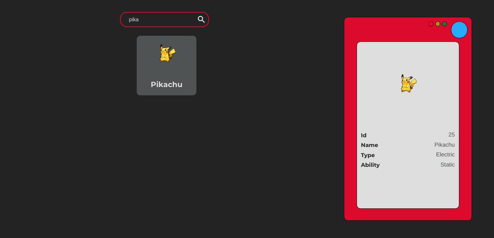

# Pokedex
This project was build with React and hooks, its functionality is describe pokemons data

## Intallation
- npm install
- npm run start

## Api
 You can find it in url [PokéAPI](https://pokeapi.co/)

